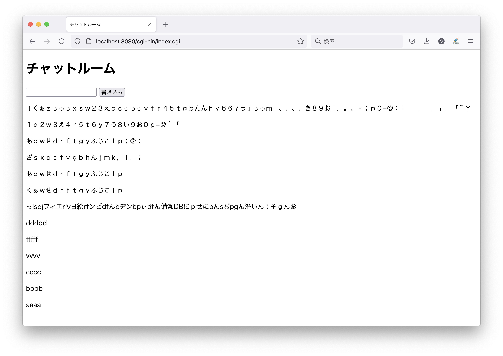

# legacy_chat



2000年代初頭のインターネットにあった感じのチャット

## 必要なもの

- docker

## 起動方法

```sh
git clone https://github.com/miminashi/legacy_chat.git
cd legacy_chat
./run.sh
```

または、

```sh
touch log
chmod o+w log
docker run --rm -t -v $(pwd)/log:/var/www/cgi-bin/log -p 8080:80 miminashi/legacy_chat
```

## 開発

```sh
git clone https://github.com/miminashi/legacy_chat.git
cd legacy_chat
./debug.sh
```

http://localhost:8080/ にアクセスする

## 参考

- シェルスクリプトでURLデコードを行う方法: https://inokara.hateblo.jp/entry/2020/12/06/090828
- 使っているdockerイメージ: https://hub.docker.com/r/sebp/lighttpd
- https://www.tohoho-web.com/ex/http.htm
- https://www.tohoho-web.com/wwwcgi3.htm
- https://www.atmarkit.co.jp/ait/articles/1406/20/news007_2.html
